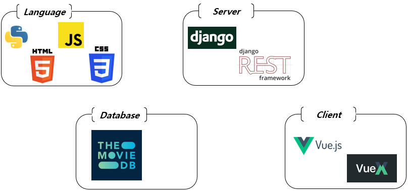
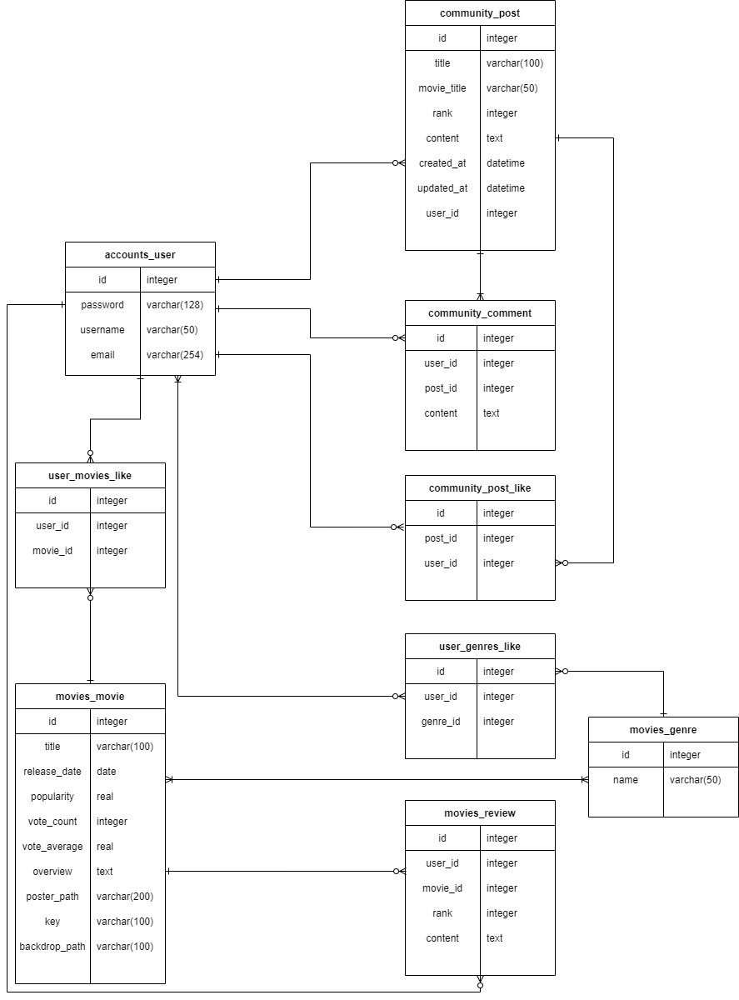

[TOC]

# README

> 영화 정보 제공 및 유저 의견나눔 커뮤니티
>
> - 아키텍처: Django REST API 서버 & Vue.js
> - 개발기간: 2021.05.19 ~ 05.27 총 8일

## 1. 팀원 정보 및 업무 분담 내역

**한훈희**

- ERD모델링

- 백엔드

  - `accounts CRUD`
  - `community CRUD`
  - `movies` RESTful 개발

- 프론트엔드

  - `vue.js` 동적 스타일링
  - `router` 구성
  - `components` movie 설계
  - `accounts` vuex로 설계
  - 기타 스타일링

  

**허진녕**

- ERD 모델링
- API를 통한 영화 데이터베이스 구성
- 백엔드

  - `accounts CRUD`
  - `community CRUD`
  - user-movies, reviews CRUD
  - 프론트에서 필요한 API 요청 URI 구성
- 프론트엔드
  - movie search movie detail 기능
  - 영화 추천 알고리즘, 영화 추천 페이지
  - community 관련 동작 연결
  - 그 외 컴포넌트 스타일링

## 2. 개발 환경

## 3. 목표 서비스 구현 및 실제 구현 정도

> 평론가 평점 기반 현재 베스트 영화 추천 서비스 
>
> 사용자 선호 영화 기반의 영화 추천 서비스
>
> 영화별 리뷰, 평점 기능
>
> 유저들의 영화 토론 커뮤니티 기능
>
> 각 유저의 프로필 페이지, 선호 장르 지정 기능
>
> 영화 검색 기능

## 4. 데이터베이스 모델링(ERD)

## 5. 필수 기능에 대한 설명

- **관리자 뷰 (django-admin)** 

  - 관리자 권한의 유저만 영화 등록 / 수정 / 삭제 권한을 가집니다.
  - 관리자 권한의 유저만 유저 관리 권한을 가집니다.
  - 장고에서 기본적으로 제공하는 admin기능을 이용하여 구현합니다.

  

- **영화 정보**

  - 영화 정보는 data seeding 을 활용하여 최소 50개 이상의 데이터가 존재하도록 구성해야 합니다. (TMDB Api를 사용하여 데이터를 수집하여 저장)
  - 모든 로그인 된 유저는 영화에 대한 별점, 리뷰 등록 / 수정 / 삭제가  가능
  - 영화 전체 리스트에서 추천영화 목록, 전체 영화목록의 개봉일을 확인할 수 있습니다.
  - 영화 상세보기 페이지 내에서 영화의 평점, 좋아요 개수, 개봉일, 전체줄거리, 유튜브 트레일러, 포스터를 확인할 수 있고 좋아요를 표시할 수 있습니다.
  - 영화 상세보기 페이지 내 리뷰 탭에서 다른 유저들이 남긴 리뷰를 확인하고 자신의 리뷰와 평점을 남길 수 있습니다.
  - 상단 바의 search 창을 통해 영화검색을 할 수 있습니다.

  

- **추천 알고리즘**

  - 평론가 평점 기반 현재 베스트 영화 추천

    - 현재 개봉해있는 영화의 리스트  중에 평점이 높은 순서대로 5개의 영화를 django REST Api에서 불러옵니다.

  - 각 유저의 선호 영화별 영화 추천

    - 좋아요를 누른 영화의 정보가 유저 정보에 남게 됩니다.

    - 그 영화들을 토대로 추천할만한 비슷한 영화들의 리스트를 보여줍니다.

      api 요청 : `https://api.themoviedb.org/3/movie/${movieId}/similar`

      `https://api.themoviedb.org/3/movie/${movieId}/recommend`

  - 프로필 페이지 내 선호 장르를 통한 영화 추천

    - 유저들이 프로필 페이지에서 선호장르를 선택하면 유저 정보에 남게 됩니다.
    - 그 장르들을 토대로 api를 요청해 해당 장르의 영화를 가져옵니다.

  

- **커뮤니티**

  - 영화 정보와 관련된 대화를 할 수 있는 커뮤니티 기능(영화 제목, 개인평점 항목 존재)
  
  - 로그인한 사용자만 글 조회 / 생성 가능
  
  - 작성자 본인만 글 수정 / 삭제 가능
  
  - 로그인한 사용자만 댓글 조회 / 생성 가능
  
  - 게시글 좋아요/좋아요취소 기능
  
    
  
- **반응형 웹**

  - 메인 홈페이지 영화리스트에 grid system 적용
  - 커뮤니티 관련 페이지 grid system 적용
  - 로그인페이지, 회원가입 페이지 grid system 적용

- **기타 추가 기능**
  - 영화 상세 정보 내에서 유튜브 공식 트레일러 확인 및 자동재생
  - 마이 프로필 페이지에서 내가 작성한 리뷰, 글, 댓글 확인 기능
  - 나의 선호 장르 확인 및 수정 기능
  - vue를 사용한 다양한 반응형 웹 디자인 

## 6. 배포 서버 URL

미정

## 7. 기타(느낀점)

> 허진녕

### **백엔드**

**1) 초기 구상을 확실하게 하자** 

​	프로젝트가 진행됨에 따라 모델링의 구조와 Api 서버의 구성이 계속 추가가 되었다.

​	처음부터 확실하게 프로젝트가 원하는 기능, 구조를 만드는것의 중요함을 깨달았다.

### **프론트엔드** 

**1) 프론트와 백의 동작을 확실히 구분하자**

​	백엔드에서 처리했으면 별 오류 없이 처리했을 부분에 시간을 많이 잡아먹혔다.

**2) JavaScript의 내실을 다지자**

​	1번의 느낀점과 같은 맥락.

​	특히 JS의 핵심인 비동기식 처리를 늦게 깨달은 것이 아쉽다.

### **GIT 협업** 

**1) Branch를 좀 더 세분화하자** 

​	초반에 git 처리를 간과하여 번거롭게 파일을 다시 받고 새로 쓰는 경우가 많았다. 

**2) 협업 툴 다양화**

​	같이 생각하고 작성한 모델링같은 경우 visual code의 live sharing을 사용하였다. 

​	이런 툴들을 잘 사용하면 더 협업을 잘 진행할 수 있을것이다.

### **보완해야 할 점** 

​	비동기식 처리에 더 강해지기

​	JS문법 공부하기

> 한훈희

### **백엔드**

**1) ERD 구성을 잘하자**

- 초기 모델링을 하고, 설계를 하는 중 client 부분에서 필요한 모델을 많이 발견했습니다. 예를 들어 youtube 연결을 위한 key와 background image 사용을 위한 backdrop_path입니다. 백엔드부터 확실히 모델링을 하여 client를 개발하는 데 오류가 없도록 하겠습니다.

### **프론트엔드** 

**1) 불필요한 라이브러리를 설치하지 말자**

- 좀 더 편하고 효과적으로 쓰기 위해 불필요한 라이브러리를 많이 설치해서 시간을 많이 잡아먹었습니다.

**2) 확실한 비동기식 처리**

- `Header` 가 중요한 것을 몰랐는데, 비동기식으로 동작할 때 token 때문에 HTTP 401 에러가 상당히 많이 걸렸습니다. 다음 프로젝트부턴 각 token마다 header를 기입하여 오류를 없애겠습니다. 

### **GIT 협업** 

**1) VS Code Live Share 사용**

- VS Code의 Live Share를 사용하여 초반 모델링 및 백엔드 설계를 같이 하는 데 시간을 많이 줄였습니다.

  백엔드를 이틀만에 완료했습니다. (21.05.19 ~ 21.05.20)

**2) GIT merge 오류**

- 같은 레지토리를 작업하는 경우 branch로 작업해도 merge 충돌이 많이 일어났습니다. 이는 팀원과 좀더 많은 소통을 하면서 진행하는 계기가 되었습니다.

### **보완해야 할 점** 

- `Vue.js` , `JavaScript` 좀 더 보완하기
  - 기본적인 문법을 제외하고 props, emit / event 등을 사용하는 데 있어 헷갈리는 점이 많아 상당히 고생했습니다.
- `CSS` 스타일링
  - CSS의 position이 생각보다 큰 부분을 차지하는 것을 알았습니다. 원하는 위치에 원하는 기능을 표현하기 위해서는 front의 기술 스택을 더 쌓아야 할 것 같습니다.